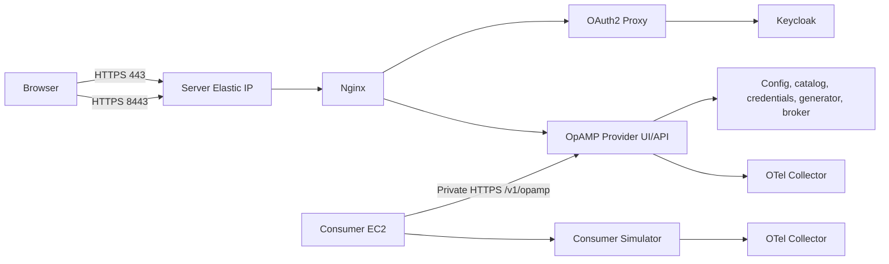
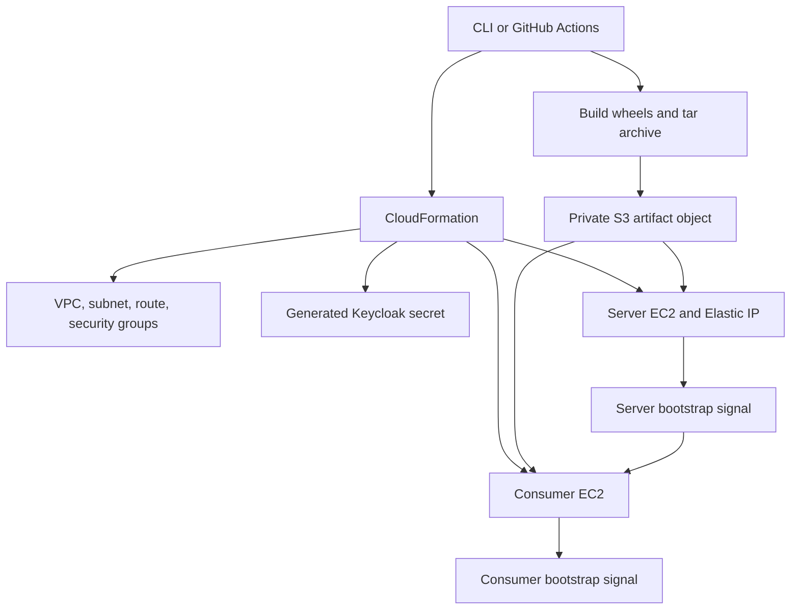

<!--
Copyright 2026 mp3monster.org
Licensed under the Apache License, Version 2.0 (the "License");
you may not use this file except in compliance with the License.
You may obtain a copy of the License at
http://www.apache.org/licenses/LICENSE-2.0

Unless required by applicable law or agreed to in writing, software
distributed under the License is distributed on an "AS IS" BASIS,
WITHOUT WARRANTIES OR CONDITIONS OF ANY KIND, either express or implied.
See the License for the specific language governing permissions and
limitations under the License.
-->

# OpAMP AWS Deployment

This folder is the AWS equivalent of `cloud/azure`. It deploys a two-instance
OpAMP regression and demonstration environment from a command line or a
manually triggered GitHub Actions workflow.

Start with the [cloud operator guide](../operator_guide.md) for a provider-neutral
walkthrough of the lifecycle, terminology, ownership boundaries, and failure
model. This document supplies the AWS-specific commands and settings.

The deployment creates billable AWS resources. Destroy the stack when it is no
longer needed.

## Architecture





## What Gets Created

- one VPC, public subnet, internet gateway, route table, and route
- separate server and consumer security groups
- two encrypted Ubuntu 22.04 EC2 instances with IMDSv2 required
- one Elastic IP for the server
- EC2 roles limited to the selected S3 artifact object, with secret access only on the server
- one Secrets Manager secret containing a generated Keycloak administrator password
- CloudFormation wait conditions that fail and roll back when VM bootstrap fails

The deploy script separately creates a retained S3 bucket when one is not
provided. Because that bucket is not a CloudFormation resource, stack deletion
does not remove its artifacts or regression records.

The server exposes `443`, `8443`, and SSH from `AdminSourceCidr`. The consumer
only exposes SSH from that CIDR. Both instances need outbound internet access to
install packages and retrieve container images.

## Files

- `template.yaml` - CloudFormation infrastructure and EC2 bootstrap
- `parameters.example.env` - non-secret deployment parameters
- `deploy.sh` / `deploy.ps1` - package, upload, validate, and deploy
- `destroy.sh` / `destroy.ps1` - delete the CloudFormation stack
- `destroy-bucket.sh` / `destroy-bucket.ps1` - permanently delete retained S3 storage
- `scripts/package-cloud-artifacts.sh` / `.ps1` - build wheels and the S3 archive
- `.github/workflows/deploy_aws.yml` - manual OIDC-authenticated GitHub deployment

The VM runtime scripts remain under `cloud/azure/scripts` for backward
compatibility, but are platform-neutral. The AWS packager places those scripts
and the built wheels into one archive before uploading it to S3.

AWS references:

- [CloudFormation EC2 instances](https://docs.aws.amazon.com/AWSCloudFormation/latest/TemplateReference/aws-resource-ec2-instance.html)
- [CloudFormation wait conditions](https://docs.aws.amazon.com/AWSCloudFormation/latest/UserGuide/using-cfn-waitcondition.html)
- [Secrets Manager generated secrets](https://docs.aws.amazon.com/AWSCloudFormation/latest/TemplateReference/aws-resource-secretsmanager-secret.html)
- [GitHub OIDC credential action](https://github.com/aws-actions/configure-aws-credentials)
- [AWS CLI CloudFormation deploy](https://docs.aws.amazon.com/cli/latest/reference/cloudformation/deploy.html)

## Prerequisites

- AWS CLI v2 configured for the target account
- Python 3.10 or newer
- Bash, Windows PowerShell 5.1, or PowerShell 7
- `tar`
- an existing EC2 key pair in the target region, or permission to create one
- permissions to create a private S3 bucket, upload artifacts, and deploy the template resources

Confirm the active identity and region:

```bash
aws sts get-caller-identity
aws configure get region
```

Create an EC2 key pair if needed. Store the private key securely.

Bash:

```bash
aws ec2 create-key-pair \
  --region eu-west-2 \
  --key-name opamp-regression \
  --query KeyMaterial \
  --output text > opamp-regression.pem
chmod 600 opamp-regression.pem
```

PowerShell on Windows:

```powershell
$privateKeyPath = Join-Path $PWD "opamp-regression.pem"
$currentIdentity = [System.Security.Principal.WindowsIdentity]::GetCurrent().Name
$keyMaterial = aws ec2 create-key-pair `
  --region eu-west-2 `
  --key-name opamp-regression `
  --query KeyMaterial `
  --output text
if ($LASTEXITCODE -ne 0) {
    throw "Unable to create the EC2 key pair."
}
$keyMaterial | Set-Content -LiteralPath $privateKeyPath -Encoding ascii
& icacls.exe $privateKeyPath /inheritance:r /grant:r "${currentIdentity}:(R)"
if ($LASTEXITCODE -ne 0) {
    throw "Unable to restrict the private key permissions."
}
```

The `icacls` command is the Windows equivalent of `chmod 600`: it removes
inherited permissions and grants read access only to the current Windows user.

The deploy script creates a private S3 bucket when `ARTIFACT_BUCKET` or
`-ArtifactBucket` is omitted. Its name includes the AWS account ID and the
current UTC date and time, for example
`opamp-regression-123456789012-20261005174530`. The generated name is also
written to `dist/aws-artifact-bucket.txt`.

## Configure Parameters

Copy the example without committing the local file:

```bash
cp cloud/aws/parameters.example.env cloud/aws/parameters.local.env
```

Set `KeyName` to the EC2 key pair name. Set `AdminSourceCidr` to your public
IPv4 address with `/32`, or leave its example placeholder unchanged to have the
deploy script detect the current public IPv4 address through
`https://checkip.amazonaws.com`. Explicit values are never replaced. No
password belongs in this file; CloudFormation generates the Keycloak
administrator password in Secrets Manager.

The default AMI parameter selects Canonical Ubuntu 22.04 AMD64 dynamically in
the selected region. The supported default instance types are therefore the
x86-based `t3` choices listed in the template.

## Deploy From A Command Line

Bash, from the repository root:

```bash
AWS_REGION=eu-west-2 \
STACK_NAME=opamp-regression \
PARAMETERS_FILE=cloud/aws/parameters.local.env \
bash cloud/aws/deploy.sh
```

PowerShell:

```powershell
.\cloud\aws\deploy.ps1 `
  -AwsRegion eu-west-2 `
  -StackName opamp-regression `
  -ParametersFile cloud/aws/parameters.local.env
```

To have the command-line deploy create an EC2 key pair and store its private
key locally, leave the example `KeyName` placeholder in the parameter file and
enable key creation. The administrator CIDR can also remain as its placeholder
to use automatic public IPv4 detection.

Bash:

```bash
CREATE_KEY_PAIR=true \
PARAMETERS_FILE=cloud/aws/parameters.local.env \
bash cloud/aws/deploy.sh
```

PowerShell:

```powershell
.\cloud\aws\deploy.ps1 `
  -ParametersFile cloud/aws/parameters.local.env `
  -CreateKeyPair
```

By default, the generated key-pair name is
`<stack-name>-<UTC timestamp>` and its private key is written to
`dist/aws-key-pairs/<key-pair-name>.pem`. The scripts refuse to overwrite an
existing private key and restrict the file to the current user. Use
`NEW_KEY_PAIR_NAME` and `PRIVATE_KEY_FILE` with Bash, or `-NewKeyPairName` and
`-PrivateKeyFile` with PowerShell, to override these defaults. Relative private
key paths are resolved from the repository root.

Generated key pairs are not part of the CloudFormation stack and are not
removed by ordinary infrastructure teardown. Delete one explicitly when it is
no longer needed, then remove its local private key:

```bash
aws ec2 delete-key-pair --region eu-west-2 --key-name KEY_PAIR_NAME
rm dist/aws-key-pairs/KEY_PAIR_NAME.pem
```

PowerShell:

```powershell
aws ec2 delete-key-pair --region eu-west-2 --key-name KEY_PAIR_NAME
Remove-Item -LiteralPath .\dist\aws-key-pairs\KEY_PAIR_NAME.pem
```

The generating identity requires `ec2:CreateKeyPair` and `ec2:CreateTags`.
`ec2:DeleteKeyPair` is also required for explicit deletion and for automatic
cleanup when private key material cannot be stored locally.

The deployment script builds all component wheels, creates
`dist/opamp-cloud-artifacts.tar.gz`, creates or reuses private retained S3
storage, validates the template, deploys it, and prints the stack outputs. It
also generates
`dist/aws-regression-results/<UTC timestamp>/connection_details.md` with the
OpAMP and Keycloak URLs plus SSH commands for both instances. The guide is
uploaded beside `stack-outputs.json` in retained S3 storage.
Pass `ARTIFACT_BUCKET=<bucket-name>` or `-ArtifactBucket <bucket-name>` to reuse
an existing bucket instead of creating a timestamped one.

Set `SKIP_PACKAGE=true` for Bash or `-SkipPackage` for PowerShell to reuse an
existing local archive. Set `CLOUDFORMATION_ROLE_ARN` or
`-CloudFormationRoleArn` when deployments must use a dedicated CloudFormation
execution role.

When the deploy script creates an EC2 key pair, its generated connection guide
automatically includes the local PEM path. For an existing key pair, set
`PRIVATE_KEY_FILE` with Bash or pass `-PrivateKeyFile` with PowerShell to add
the corresponding identity path to each SSH command. If `KeyName` still has its
placeholder value, the deployment infers the key-pair name from that PEM's file
name and verifies it in the selected AWS region. Without a path, the SSH commands
use the SSH agent or the platform's default identity.

If CloudFormation deployment fails, the command-line scripts automatically
print all stack events whose status contains `FAILED`, including the logical
resource, resource type, status, timestamp, and AWS reason. The same details
can be requested again with:

```bash
aws cloudformation describe-stack-events \
  --region eu-west-2 \
  --stack-name opamp-regression \
  --query "StackEvents[?contains(ResourceStatus, 'FAILED')].[Timestamp,LogicalResourceId,ResourceType,ResourceStatus,ResourceStatusReason]" \
  --output table
```

A wait-condition reason ending with `bootstrap failed at line 28` identifies
the shared installer invocation, not the failing command inside that installer.
Current artifacts normalize Bash scripts and the wheel manifest to LF line
endings for Ubuntu, and log installer output separately. Destroy the failed
stack and deploy again without `SKIP_PACKAGE=true` or `-SkipPackage` so the
archive is rebuilt. A subsequent
installer failure includes its final log lines in the stack event; the complete
logs remain available on the affected instance at
`/var/log/opamp-install.log` and `/var/log/opamp-bootstrap.log` while that
instance exists.

Each successful deployment uploads its CloudFormation outputs and connection
guide under `regression-results/<UTC timestamp>/`. Deployment does not itself
run a test set. Use the provider-neutral regression command to run selected
tests and upload the complete `dist/test-reports/` tree to
`regression-results/<UTC timestamp>/test-reports/`:

```bash
python cloud/run_regression.py --provider aws --only st001
```

On Windows PowerShell, the equivalent command is:

```powershell
py -3 cloud/run_regression.py --provider aws --only st001
```

The command reads the bucket from `dist/aws-artifact-bucket.txt`, returns the
regression pack's failure status after attempting the upload, and writes a
`cloud_upload_manifest.json` into the uploaded reports. To publish reports from
an already completed run without rerunning it, use:

```powershell
py -3 cloud/run_regression.py --provider aws --upload-only
```

## Deploy From GitHub

The `Deploy AWS OpAMP regression environment` workflow is manual-only. It does
not deploy on pushes.

1. Configure `token.actions.githubusercontent.com` as an IAM OIDC provider with
   audience `sts.amazonaws.com`.
2. Create a role whose trust policy limits the `sub` claim to this repository
   and the branches allowed to deploy.
3. Grant that role access to create and configure S3 buckets, upload objects,
   and operate the CloudFormation stack. If a separate execution role is used,
   also allow `iam:PassRole` for that one role.
4. Add repository secret `AWS_ROLE_TO_ASSUME` containing the OIDC role ARN.
5. Optionally add `AWS_CLOUDFORMATION_ROLE_ARN` containing the execution role ARN.
6. Run the workflow from the Actions tab, select `deploy`, and provide the EC2
   key pair and administrator CIDR inputs. Leave the bucket input blank to
   create timestamped retained storage.

The workflow requests `id-token: write` and uses temporary OIDC credentials. Do
not add long-lived AWS access keys as repository secrets.

GitHub changed OIDC subject claims for some repositories in July 2026 to add
immutable organization and repository IDs. Inspect a token from this repository
and follow the current `configure-aws-credentials` guidance when writing the IAM
trust condition.

## Use The Deployment

The CloudFormation outputs include:

- `OpampUiUrl`
- `KeycloakUrl`
- `ServerSsh`
- `ConsumerSsh`
- `KeycloakAdminSecretArn`
- both EC2 instance IDs

The HTTPS certificate is self-signed. Continue past a browser warning only when
the displayed IP matches the `OpampUiUrl` output.

The regular UI account is generated by the startup script. Read it over SSH:

```bash
ssh -i opamp-regression.pem ubuntu@<server-elastic-ip>
sudo cat /etc/opamp/opamp-ui-user.txt
```

Retrieve the Keycloak administrator record when administration is required:

```bash
aws secretsmanager get-secret-value \
  --region eu-west-2 \
  --secret-id <KeycloakAdminSecretArn> \
  --query SecretString \
  --output text
```

## Check And Upgrade

Server health:

```bash
sudo systemctl status opamp-provider config-service catalog-service
sudo systemctl status svr-credentials-manager-service opamp-broker
sudo docker ps
sudo tail -n 100 /var/log/opamp-bootstrap.log
```

Consumer health:

```bash
sudo systemctl status opamp-consumer-simulator
sudo docker ps
sudo tail -n 100 /var/log/opamp-bootstrap.log
```

CloudFormation user data runs on the initial instance boot, so uploading a new
archive to the same S3 key does not upgrade an existing instance. For a clean
regression deployment, destroy and redeploy the stack. For wheel-only testing,
download and extract the new archive on the instance, rerun `install-opamp.sh`
with `OPAMP_WHEEL_SOURCE_DIR`, then restart the relevant systemd services.

## Running Cost

This environment is metered and is not permanently free. Its main cost drivers
are two `t3.small` EC2 instances, two 30 GB `gp3` EBS volumes, two public IPv4
addresses, one Secrets Manager secret, the S3 artifact, and outbound data
transfer. Prices vary by region; use the
[AWS Pricing Calculator](https://calculator.aws/) for a current estimate.

For current new AWS accounts, `t3.small` and `gp3` are Free Plan eligible and
the stack can consume the account's promotional credits. The Free Plan lasts
for six months or until its credits are depleted, so eligibility does not make
these resources always free. Paid accounts and accounts without remaining
credits are charged at normal rates. Public IPv4 addresses are metered hourly,
and Secrets Manager charges for stored secrets and API calls. See the
[EC2 Free Tier guidance](https://docs.aws.amazon.com/AWSEC2/latest/UserGuide/ec2-free-tier-usage.html),
[VPC pricing](https://aws.amazon.com/vpc/pricing/), and
[Secrets Manager pricing](https://aws.amazon.com/secrets-manager/pricing/).

Stopping an instance avoids its compute charge, but retained EBS volumes,
Elastic IP addresses, and secrets can continue to incur charges. Delete the
stack when the regression environment is no longer required. The external S3
bucket and uploaded archive are retained and must be removed separately when
they are no longer needed.

## Tear Down

Bash:

```bash
AWS_REGION=eu-west-2 STACK_NAME=opamp-regression bash cloud/aws/destroy.sh
```

PowerShell:

```powershell
.\cloud\aws\destroy.ps1 -AwsRegion eu-west-2 -StackName opamp-regression
```

By default, the scripts report the current CloudFormation status and check
again every 30 seconds until deletion completes. Set
`DELETE_POLL_INTERVAL_SECONDS` for Bash or `-PollIntervalSeconds` for
PowerShell to change the interval. Use `WAIT_FOR_DELETE=false` or `-NoWait`
only when the caller should return immediately after requesting deletion.

The GitHub workflow also supports the `destroy` action. Stack deletion removes
the VPC, EC2 instances, disks, Elastic IP, IAM instance roles, and generated
secret. The external S3 bucket is not part of CloudFormation, so its artifacts
and timestamped `regression-results` records are intentionally retained.

Delete retained storage only when its artifacts and regression records are no
longer needed. With no bucket name, the cleanup script permanently empties and
deletes the latest bucket recorded in `dist/aws-artifact-bucket.txt`:

```bash
bash cloud/aws/destroy-bucket.sh
```

```powershell
.\cloud\aws\destroy-bucket.ps1
```

Pass a bucket name to delete an older retained bucket instead:

```bash
bash cloud/aws/destroy-bucket.sh <bucket-name>
```

```powershell
.\cloud\aws\destroy-bucket.ps1 -BucketName <bucket-name>
```

After successfully deleting the currently recorded bucket, the cleanup script
also removes `dist/aws-artifact-bucket.txt` so a repeated invocation cannot act
on a stale name.

## Security And Cost Notes

- Narrow `AdminSourceCidr`; never leave SSH open to `0.0.0.0/0`.
- Replace self-signed certificates before using this outside regression or demo environments.
- Restrict the GitHub OIDC role by repository subject and least-privilege permissions.
- The template requires IMDSv2 and encrypts both root EBS volumes.
- The server UI and Keycloak remain internet-facing, matching the Azure regression topology.
- EC2, EBS, Elastic IP, Secrets Manager, S3, and data transfer can incur charges.
- Application and consumer log levels are set to `DEBUG` for this regression environment.
