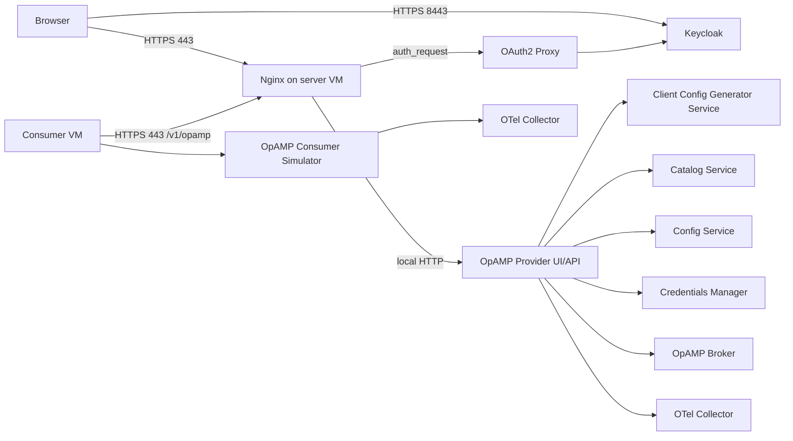
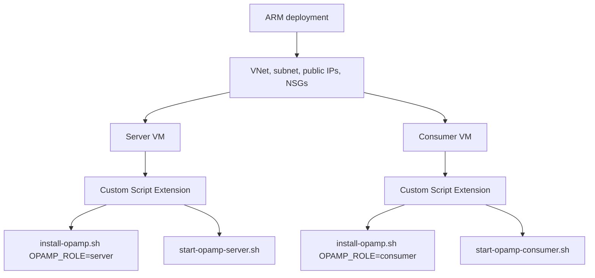
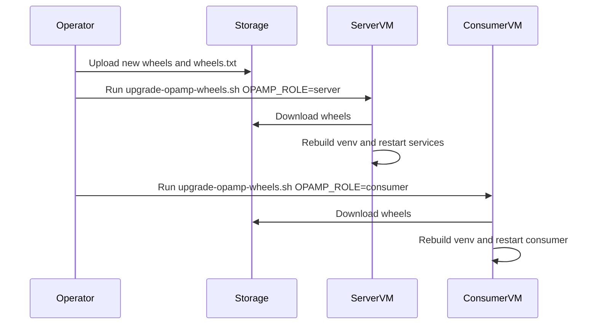

# OpAMP Azure Deployment

This folder contains an Azure Resource Manager deployment for a two-VM OpAMP
environment:

- one OpAMP server VM that runs the provider UI/API and supporting services
- one consumer VM that installs the consumer wheels and starts a simulator consumer
- Keycloak for UI identities
- OAuth2 Proxy and Nginx to protect the UI over HTTPS
- OpenTelemetry Collector on both VMs for self telemetry

The deployment is intended for regression, upgrade, and demonstration use. It
uses self-signed certificates by default.

Start with the [cloud operator guide](../operator_guide.md) for a provider-neutral
walkthrough of the lifecycle, terminology, ownership boundaries, and failure
model. This document supplies the Azure-specific commands and settings.

## Architecture





## What Gets Created

The ARM template creates:

- a resource group deployment containing all resources
- a virtual network with one subnet
- two public IP addresses with DNS names
- two Ubuntu 22.04 VMs
- one network interface per VM
- one network security group per VM
- a Custom Script Extension on each VM

The deploy script also creates a timestamped storage account in a separate
retention resource group. That account contains the public VM bootstrap
artifacts and a private `opamp-regression-results` container.

The server VM listens publicly on:

- `443` for the OpAMP UI, protected by Keycloak login through OAuth2 Proxy
- `8443` for Keycloak
- `22` for SSH from `adminSourceCidr`

The consumer VM listens publicly only on SSH from `adminSourceCidr`.

## Files

- `mainTemplate.json` - ARM template for infrastructure and VM bootstrap
- `parameters.example.json` - example parameters file to copy and edit
- `deploy.sh` / `deploy.ps1` - create or update the resource group deployment
- `destroy.sh` / `destroy.ps1` - delete the resource group and everything in it
- `destroy-bucket.sh` / `destroy-bucket.ps1` - permanently delete retained Azure storage
- `scripts/package-cloud-artifacts.sh` / `.ps1` - build wheels and deployable artifacts
- `scripts/install-opamp.sh` - installs OS packages, downloads or builds wheels, creates venvs
- `scripts/start-opamp-server.sh` - starts server-side services, Keycloak, OAuth2 Proxy, Nginx, and OTel Collector
- `scripts/start-opamp-consumer.sh` - starts the consumer simulator and OTel Collector
- `scripts/upgrade-opamp-wheels.sh` - independently reruns install and start for upgrade regression

Microsoft references:

- ARM template deployments: <https://learn.microsoft.com/en-us/azure/azure-resource-manager/templates/overview>
- Linux Custom Script Extension: <https://learn.microsoft.com/en-us/azure/virtual-machines/extensions/custom-script-linux>
- Azure CLI group deployments: <https://learn.microsoft.com/en-us/azure/azure-resource-manager/templates/deploy-cli>

## Prerequisites

Install these on your workstation:

- Azure CLI
- Docker, only needed if you also run the local wheel regression containers
- Python 3.10 or newer
- Bash, or PowerShell on Windows
- an Azure subscription
- an SSH key pair
- permission to create resource groups and storage accounts and to list storage account keys

Sign in to Azure:

```bash
az login
az account show
```

If you have more than one subscription:

```bash
az account set --subscription "<subscription id or name>"
```

Create an SSH key if you do not have one:

```bash
ssh-keygen -t rsa -b 4096 -f ~/.ssh/opamp-azure
```

Find your public IP address:

```bash
curl https://api.ipify.org
```

Use that value with `/32` for `adminSourceCidr`.

## Package The Artifacts

The deploy scripts package and upload the scripts and wheels automatically.
Run a packager directly only when you need to inspect or reuse its output:

From the repository root:

```bash
bash cloud/azure/scripts/package-cloud-artifacts.sh
```

```powershell
.\cloud\azure\scripts\package-cloud-artifacts.ps1
```

This creates:

```text
dist/cloud-azure-artifacts/
  scripts/
  wheels/
    wheels.txt
    *.whl
```

When no storage account is supplied, deployment creates one named from the
current UTC date and time plus a subscription suffix, for example
`opamp20261005174530abc12`. It is placed in `<resource-group>-retained`, which
is separate from the VM resource group. The generated name is written to
`dist/azure-retention-storage-account.txt`.

## Configure Parameters

Copy the example file:

```bash
cp cloud/azure/parameters.example.json cloud/azure/parameters.local.json
```

Edit `cloud/azure/parameters.local.json`:

- replace `sshPublicKey` with the contents of your `.pub` key
- replace `adminSourceCidr` with your public IP plus `/32`
- set `keycloakAdminPassword` to a long password
- change `location` if required

The deploy scripts override `artifactBaseUrl` and `wheelArtifactBaseUrl` with
the generated storage URL, so their example values do not need to be edited.

Keep `parameters.local.json` out of source control.

## Deploy

Bash:

```bash
RESOURCE_GROUP=opamp-regression-rg \
LOCATION=uksouth \
PARAMETERS_FILE=cloud/azure/parameters.local.json \
bash cloud/azure/deploy.sh
```

PowerShell:

```powershell
.\cloud\azure\deploy.ps1 `
  -ResourceGroup opamp-regression-rg `
  -Location uksouth `
  -ParametersFile cloud/azure/parameters.local.json `
  -SshPrivateKeyFile "$HOME/.ssh/opamp-azure"
```

When the deployment completes, Azure prints outputs like:

- `opampUiUrl`
- `keycloakUrl`
- `serverSsh`
- `consumerSsh`

It also generates
`dist/azure-regression-results/<UTC timestamp>/connection_details.md` with the
OpAMP and Keycloak URLs plus SSH commands for both VMs. Set
`SSH_PRIVATE_KEY_FILE` for Bash or `-SshPrivateKeyFile` for PowerShell to add
the local identity path to those commands; otherwise they use the SSH agent or
default identity. The script prints the guide path, retained storage account,
and private results location. Pass
`STORAGE_ACCOUNT=<name>` to Bash or `-StorageAccount <name>` to PowerShell to
reuse an existing account. Use `SKIP_PACKAGE=true` or `-SkipPackage` to reuse
the existing local artifact directory.

Each successful deployment uploads its ARM outputs and `connection_details.md`
under the private `opamp-regression-results/<UTC timestamp>/` prefix. Upload
additional reports to that private container, for example:

```bash
STORAGE_ACCOUNT="$(cat dist/azure-retention-storage-account.txt)"
RESULT_SET="$(date -u +%Y%m%d%H%M%S)"
az storage blob upload-batch \
  --account-name "$STORAGE_ACCOUNT" \
  --destination opamp-regression-results \
  --destination-path "$RESULT_SET" \
  --source test-results \
  --auth-mode key \
  --overwrite
```

Open `opampUiUrl` in a browser. Because the certificate is self-signed, the
browser will show a certificate warning. Continue only if the hostname matches
the deployed server.

## UI Credentials

The startup script creates an OpAMP realm user in Keycloak. SSH to the server
VM and read the generated credentials:

```bash
ssh azureuser@<server-fqdn>
sudo cat /etc/opamp/opamp-ui-user.txt
```

You can then log in through the UI. Further user and password changes are made
inside Keycloak.

## Check The Deployment

SSH to the server VM:

```bash
sudo systemctl status opamp-provider
sudo systemctl status config-service
sudo systemctl status catalog-service
sudo systemctl status svr-credentials-manager-service
sudo systemctl status opamp-broker
sudo docker ps
```

SSH to the consumer VM:

```bash
sudo systemctl status opamp-consumer-simulator
sudo docker ps
```

Logs:

```bash
sudo journalctl -u opamp-provider -n 100 --no-pager
sudo journalctl -u opamp-consumer-simulator -n 100 --no-pager
sudo tail -n 100 /var/log/opamp/otel-collector.json
```

## Upgrade Regression

Upload a new artifact pack to the same storage container, then rerun the upgrade
script independently on either VM.

Server VM:

```bash
sudo OPAMP_ROLE=server \
  OPAMP_WHEEL_SOURCE_URL=https://<storage-account>.blob.core.windows.net/opamp-cloud \
  bash /var/lib/waagent/custom-script/download/0/upgrade-opamp-wheels.sh
```

Consumer VM:

```bash
sudo OPAMP_ROLE=consumer \
  OPAMP_WHEEL_SOURCE_URL=https://<storage-account>.blob.core.windows.net/opamp-cloud \
  OPAMP_SERVER_URL=https://10.42.0.10 \
  OPAMP_SERVER_HOST=<server-fqdn> \
  bash /var/lib/waagent/custom-script/download/0/upgrade-opamp-wheels.sh
```



## Running Cost

This environment is metered and is not permanently free. Its main cost drivers
are two `Standard_B2s` Linux VMs, two Standard SSD LRS operating-system disks,
two Standard static public IPv4 addresses, retained blob storage, and outbound
data transfer. Prices vary by region and agreement; use the
[Azure Pricing Calculator](https://azure.microsoft.com/pricing/calculator/) for
a current estimate.

An Azure free account includes an introductory credit, but the template's
default `Standard_B2s` size is not one of the Linux VM sizes included in the
12-month free allowance. The currently listed free sizes are `B1s`,
`B2pts v2`, and `B2ats v2`; these smaller sizes are not recommended for this
multi-service regression environment. The introductory credit can cover the
default deployment temporarily, after which normal VM, disk, public IP, and
bandwidth charges apply. See the
[Azure free account limits](https://azure.microsoft.com/free/),
[Linux VM pricing](https://azure.microsoft.com/pricing/details/virtual-machines/linux/),
[managed disk pricing](https://azure.microsoft.com/pricing/details/managed-disks/),
and [public IP pricing](https://azure.microsoft.com/pricing/details/ip-addresses/).

Deallocating both VMs stops their compute charges, but retained disks and
public IP addresses can continue to incur charges. Delete the deployment's
resource group when the regression environment is no longer required. The
separate retention account remains billable until it is explicitly deleted.

## Tear Down

Deleting the deployment resource group removes the VMs, disks, IP addresses,
NICs, and network resources.

Bash:

```bash
RESOURCE_GROUP=opamp-regression-rg bash cloud/azure/destroy.sh
```

PowerShell:

```powershell
.\cloud\azure\destroy.ps1 -ResourceGroup opamp-regression-rg
```

The timestamped storage account is deliberately outside the deployment resource
group. Deleting the regression infrastructure therefore preserves its artifact
pack and private deployment-output record. The following commands permanently
delete the account, every container, and all retained results:

```bash
bash cloud/azure/destroy-bucket.sh <storage-account-name>
```

```powershell
.\cloud\azure\destroy-bucket.ps1 -StorageAccount <storage-account-name>
```

The cleanup script discovers the account's retained resource group and deletes
the storage account with every container. It leaves the empty retention
resource group in place so it cannot remove unrelated retained accounts. Azure
calls this resource a storage account rather than a bucket; `-BucketName` is
accepted as a PowerShell alias for `-StorageAccount`.

## Notes And Limits

- This deployment uses self-signed certificates. Replace them with certificates
  from a trusted CA before using the environment with real users.
- `adminSourceCidr` defaults to `0.0.0.0/0` in the template for ease of testing.
  Always narrow it to your own IP for real deployments.
- The OAuth login protects the externally exposed UI path. Internal service
  ports are bound to localhost on the server VM.
- The default consumer is the simulator plugin so the deployment is repeatable
  without installing Fluent Bit, Fluentd, or Elastic Agent on the VM.
- The local container regression pack remains the primary way to prove every
  consumer plugin starts correctly.
