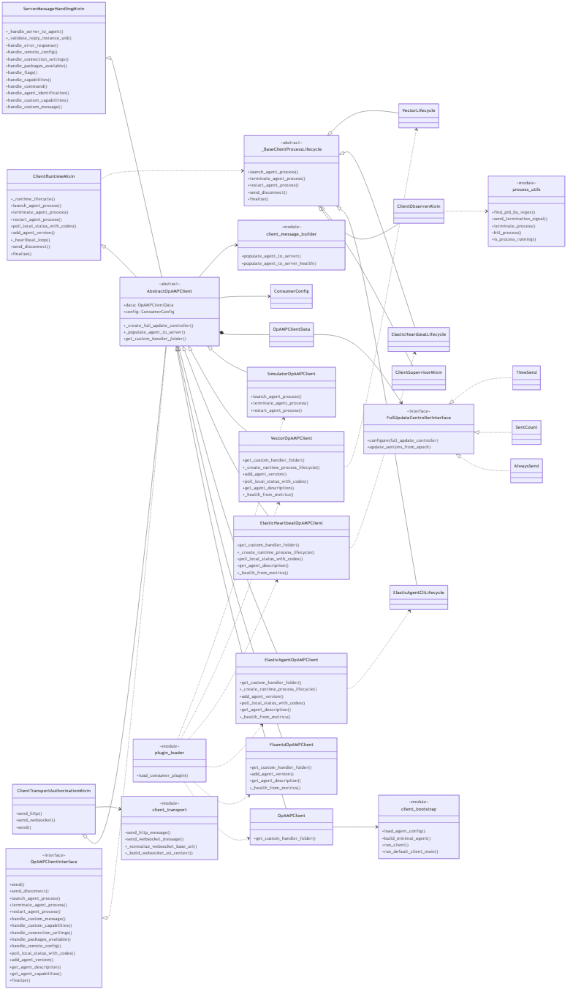
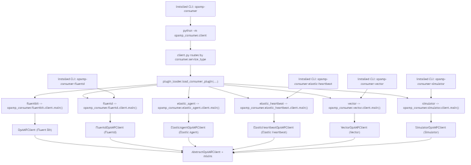
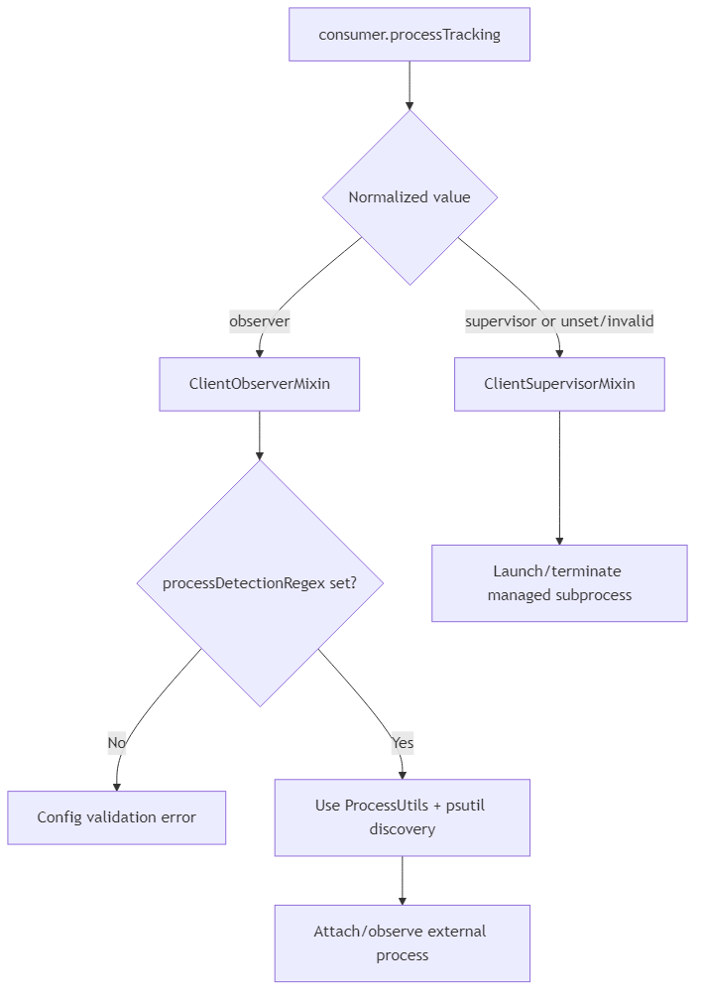
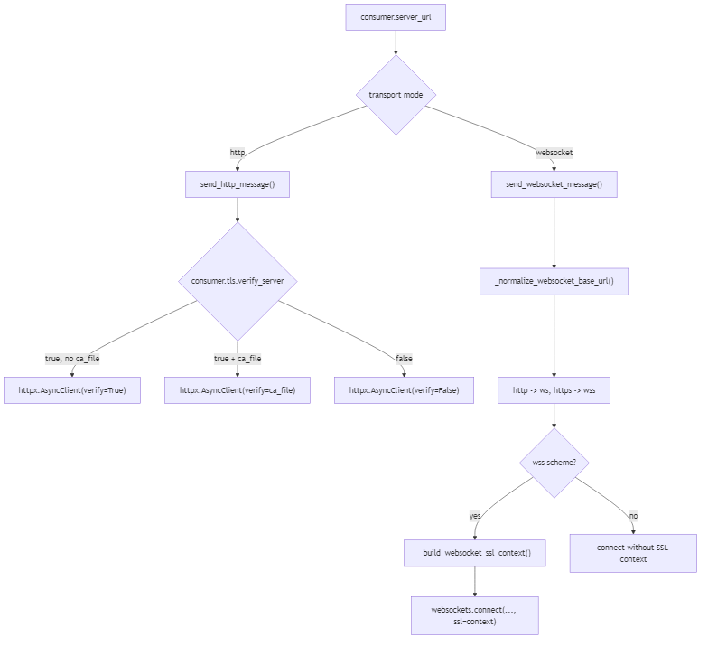
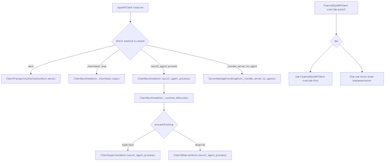
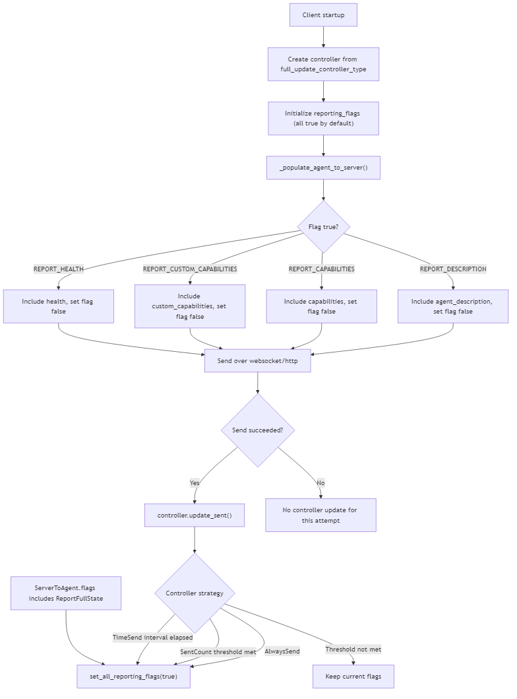

# Consumer Client Diagrams Guide

This page explains the rendered consumer client diagrams and links each one back to the Mermaid source.
For the latest architecture (including process-tracking strategy split), use the Mermaid source as canonical.

## Source and Related Docs

- Mermaid source: [docs/dev/client(consumer)/consumer_client_diagram.md](<dev/client(consumer)/consumer_client_diagram.md>)
- Consumer mixin behavior: [docs/dev/client(consumer)/consumer_mixins.md](<dev/client(consumer)/consumer_mixins.md>)
- Consumer reporting/update cadence: [docs/dev/client(consumer)/consumer_update_controllers.md](<dev/client(consumer)/consumer_update_controllers.md>)

## Diagram 1: Class and Module Relationships

What this shows:

- `AbstractOpAMPClient` composes core send/reporting behavior.
- `ClientTransportAuthorizationMixin`, `ClientRuntimeMixin`, and `ServerMessageHandlingMixin` contribute transport/auth, runtime, and server-message handling behavior.
- Runtime lifecycle delegation now routes to `ClientSupervisorMixin` or `ClientObserverMixin` based on config.
- Concrete clients (`OpAMPClient` for Fluent Bit, `FluentdOpAMPClient` for Fluentd, `ElasticAgentOpAMPClient`, `ElasticHeartbeatOpAMPClient`, `VectorOpAMPClient`, and `SimulatorOpAMPClient`) extend/override where needed.
- Elastic Agent, Elastic Heartbeat, and Vector provide specialized lifecycle helpers where the generic supervisor/observer strategy is not enough.
- Update controller implementations (`AlwaysSend`, `SentCount`, `TimeSend`) control reporting flag reset cadence.

## Diagram 2: Runtime Entrypoints

What this shows:

- Script and CLI entrypoints for Fluent Bit, Fluentd, Elastic Agent, Elastic Heartbeat, Vector, and simulator clients.
- The stable `opamp-consumer` entrypoint routes through `plugin_loader.load_consumer_plugin(...)` based on `consumer.service_type`.
- Several concrete entrypoints still call `client_bootstrap.run_default_client_main(...)` directly.
- Shared runtime behavior flowing into `AbstractOpAMPClient` + mixins.
- Provider endpoint target still comes from `consumer.server_url`.

## Diagram 3: Mixin Dispatch Model

What this shows:

- Which methods resolve in mixins vs `AbstractOpAMPClient`.
- How `ClientRuntimeMixin` delegates process lifecycle calls to strategy classes selected from `consumer.processTracking`.
- How subclass overrides (for example `FluentdOpAMPClient.add_agent_version`) win over mixin/base implementations via MRO.

## Diagram 4: Reporting Flags and Update Controllers

What this shows:

- How report flags gate which payload fields are emitted.
- When controller implementations reset flags for future sends.
- How `ReportFullState` from the server forces full reporting state.

## Diagram 5: Transport URL and TLS Resolution

What this shows:

- How `consumer.server_url` and `consumer.transport` select HTTP vs WebSocket send path.
- URL normalization for WebSocket mode (`http->ws`, `https->wss`).
- How `consumer.tls.verify_server` and `consumer.tls.ca_file` control TLS verification behavior.

## Diagram 6: Runtime Process Tracking Strategy

Use the Mermaid source in [docs/dev/client(consumer)/consumer_client_diagram.md](<dev/client(consumer)/consumer_client_diagram.md>) as the canonical source for this flow.

What this shows:

- `consumer.processTracking` normalization and strategy selection.
- default/fallback to `Supervisor`.
- required `consumer.processDetectionRegex` when using `Observer`.
