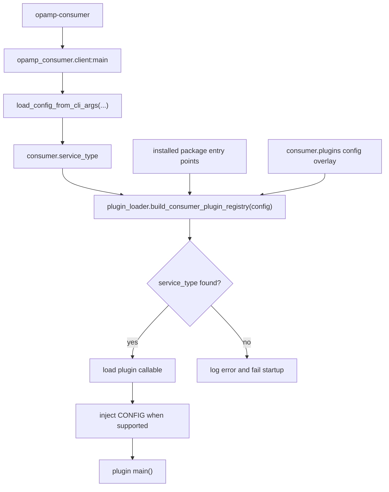

# Architecture And Loading

The consumer has one stable command for normal use:

```bash
opamp-consumer --config-path ./opamp.json
```

That command enters `opamp_consumer.client:main`. The router is intentionally
small. It parses enough shared CLI/config state to know which `service_type`
has been requested, asks the plugin loader for the matching callable, injects
the loaded config into the target module when the module exposes `CONFIG`, and
then calls the plugin entry point.

For the full picture, keep the
[consumer client architecture diagram](../consumer_client_diagram.md) open.
The "Runtime Entrypoints" diagram on that page shows the same flow visually.

## Loading Flow



The code for this lives mainly in:

- `consumer/src/opamp_consumer/client.py`
- `consumer/src/opamp_consumer/plugin_loader.py`
- `consumer/src/opamp_consumer/config.py`
- `consumer/src/opamp_consumer/plugin_config.py`

## Plugin Registry Sources

The plugin registry has three sources.

Built-in plugins are loaded from:

```text
consumer/src/opamp_consumer/builtin_consumer_plugins.json
```

That file is packaged with the consumer and is the source of truth for plugins
that ship in this repository, such as Fluent Bit, Fluentd, Elastic Agent,
Elastic Heartbeat, simulator, and Vector. Use it for in-repo built-ins instead
of adding a package entry point to `consumer/pyproject.toml`.

Installed package entry points are discovered from package metadata:

```toml
[project.entry-points."opamp_consumer.plugins"]
my_agent = "my_consumer_plugin.client:main"
```

Runtime config entries are read from `consumer.plugins`:

```json
{
  "consumer": {
    "service_type": "my_agent",
    "plugins": [
      {
        "service_type": "my_agent",
        "entry_point": "my_consumer_plugin.client:main",
        "enabled": true
      }
    ]
  }
}
```

The loader builds the registry in this order:

1. built-in JSON mappings
2. installed package entry points
3. active config overlay from `consumer.plugins`

Later sources override earlier sources for the same `service_type`. That means
config can:

- add a plugin that is importable but has no package entry point
- override an installed plugin mapping
- disable an installed plugin by setting `enabled` to `false`

This is deliberate. It gives packaged plugins a clean deployment story, while
still making local tests and one-off experiments easy.

## Service Type Names

`service_type` is the registry key. It is normalized to lowercase and stripped
of surrounding whitespace.

Good names are short and stable:

- `fluentbit`
- `fluentd`
- `elastic_agent`
- `simulator`
- `my_agent`

Avoid putting version numbers, environment names, or deployment names into the
service type. Those belong in config, package versions, or deployment metadata.

## What Happens After Loading?

After the plugin `main()` runs, the plugin is responsible for the normal
consumer bootstrap:

1. parse common CLI args with `build_common_cli_parser()`
2. load config with `load_config_from_cli_args()`
3. configure logging with `configure_logging_for_config()`
4. log the startup banner with `log_consumer_startup_banner()`
5. process plugin/agent-specific config
6. construct the concrete client
7. call the shared `run_client(...)` loop

Fluent Bit uses `run_default_client_main(...)` because its startup flow is the
default shared path. Fluentd, Elastic Agent, and simulator have their own
`main()` functions because they need extra startup work.

## CLI And Demo Integration

The OpAMP CLI is not the plugin registry. It starts processes and records them
for guided `start`, `stop`, `restart`, `status`, and demo workflows. Actual
plugin selection still belongs to the consumer config.

The CLI launch helper lives in:

```text
cli/src/opamp_cli/consumer_plugins.py
```

Use these rules when exposing a plugin through CLI guided starts or demo
profiles:

- Prefer `python -m opamp_consumer.client` for plugin-routed consumers.
- Put the plugin choice in the OpAMP JSON as `consumer.service_type`.
- Put the managed agent config path in that same JSON as
  `consumer.agent_config_path`.
- Use profile-level `agent_config_path` only as a legacy or explicit override.
- Reuse the generic helpers in `consumer_plugins.py`; do not copy a new
  per-agent command builder body.

For a built-in plugin that should appear as a top-level guided target, add:

1. an action id and label in `cli/src/opamp_cli/constants.py`
2. that action id in `GUIDED_START_ACTION_ORDER` and `GUIDED_STOP_ACTION_ORDER`
3. aliases in `GUIDED_ACTION_ALIASES`
4. a default start wrapper in `cli/src/opamp_cli/consumer_plugins.py` that calls
   the generic `_consumer_start_action(...)`
5. start/stop registration in `cli/src/opamp_cli/main.py`
6. tests for action ordering and generated argv

For demo-only support, update `cli/config/demo_consumer_profiles.json` and add a
thin wrapper that calls `_demo_consumer_start_action(...)` with the component
key, label, and module name. Demo profiles should normally specify only the
consumer `config_path`; the referenced JSON should carry `service_type` and
`agent_config_path`.

