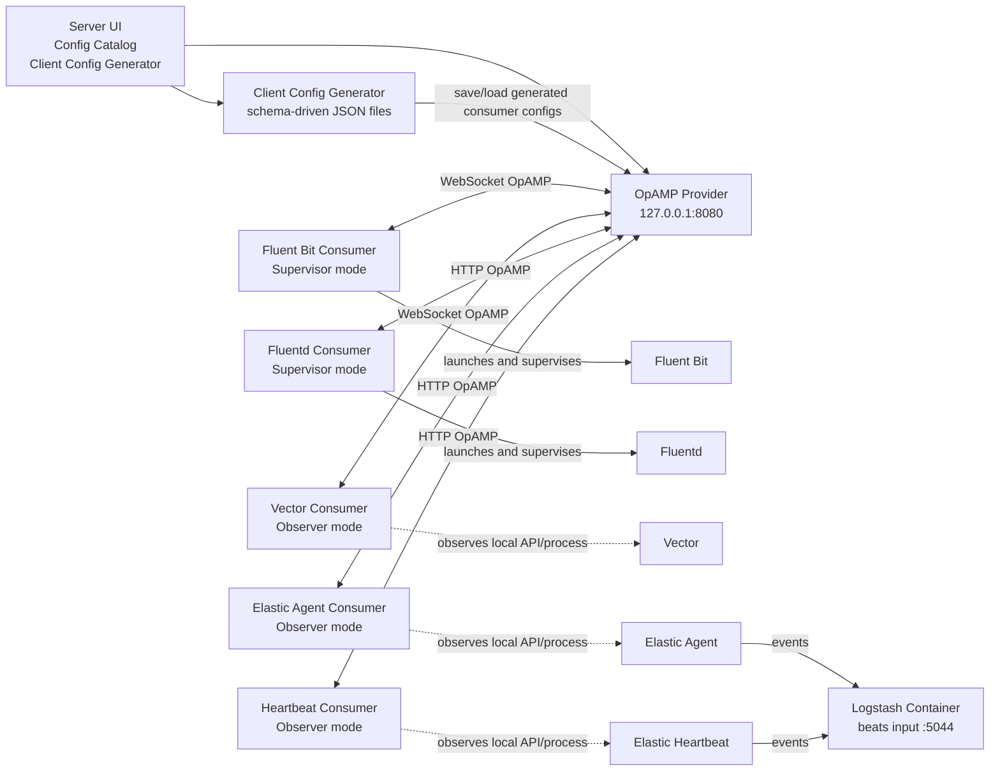
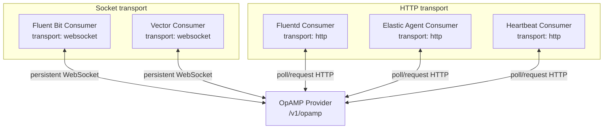
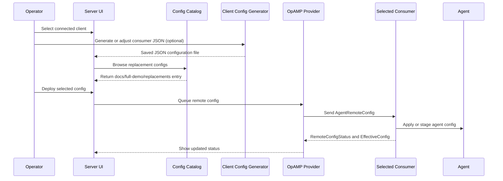

# Full Demo Presentation Overview

## Slide 1: Demo Purpose

This demo shows one OpAMP provider managing five different telemetry agents through a shared server UI.

Key points:

- Fluent Bit and Fluentd run in supervisor mode, so the consumer launches and manages the agent process.
- Vector, Elastic Agent, and Elastic Heartbeat run in observer mode, so the consumer attaches to already-running agents.
- Fluent Bit and Vector use the OpAMP WebSocket transport.
- Fluentd, Elastic Agent, and Elastic Heartbeat use the OpAMP HTTP transport.
- Active and replacement configurations are visible in the server catalog and can be deployed from the UI.
- Agent binaries can be resolved from `PATH` or supplied as absolute paths, with `use-demo-agent-paths.cmd` provided for the default local `D:\dev-tools` layout.

## Slide 2: Runtime Topology

## Slide 3: Transport Split

Speaker note:

The socket side demonstrates long-lived OpAMP connectivity for agents that benefit from persistent control channels. The HTTP side keeps the rest of the estate on the simpler request/response path.

## Slide 4: Configuration Deployment Flow

## Slide 5: Files To Point At

| Purpose | Path |
|---|---|
| Provider and catalog setup | `docs/full-demo/provider/opamp-provider-full-demo.json` |
| Active agent configs | `docs/full-demo/active` |
| Replacement configs | `docs/full-demo/replacements` |
| Consumer OpAMP configs | `docs/full-demo/consumers` |
| Logstash pipeline | `docs/full-demo/logstash/logstash.container.conf` |
| Add local agents to `PATH` | `docs/full-demo/use-demo-agent-paths.cmd` |
| Start observer-mode agents | `docs/full-demo/start-observed-agents.ps1` |
| Stop observer-mode agents | `docs/full-demo/stop-observed-agents.ps1` |

## Slide 6: Demo Success Criteria

The demo is healthy when:

- All five consumers appear in the server UI.
- Fluent Bit and Vector show WebSocket-backed OpAMP connectivity.
- Fluentd, Elastic Agent, and Heartbeat show HTTP-backed OpAMP connectivity.
- Fluent Bit and Fluentd are managed as supervisor processes.
- Vector, Elastic Agent, and Heartbeat are detected by observer-mode consumers.
- Replacement configs from `docs/full-demo/replacements` can be selected and sent from the UI.
- Elastic Agent and Heartbeat events arrive in the Logstash container output directory.
